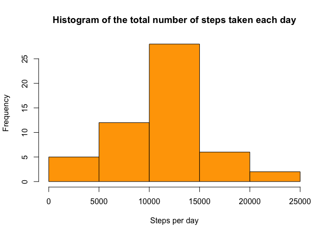
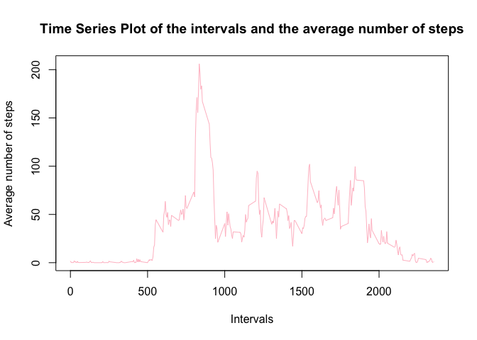
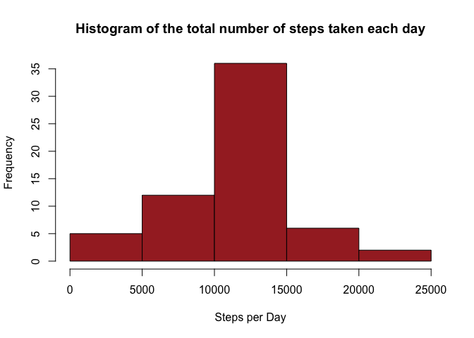
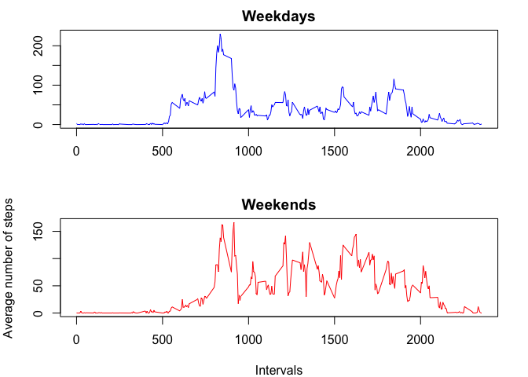

# Reproducible Research: Peer Assessment 1


##Loading and preprocessing the data

```r
unzip ("activity.zip", exdir = "./")
dt <- read.table("activity.csv", sep =",", header = TRUE)
```

##What is mean total number of steps taken per day?
###Total number of steps taken per day

```r
mean_day <- aggregate(dt[,1], list(dt$date), sum)
```
###Histogram of the total number of steps taken each day

```r
hist(mean_day$x, main = "Histogram of the total number of steps taken each day", xlab="Steps per day",col="orange")
```

 

###Mean and median of the total number of steps taken per day

```r
mean(mean_day$x,na.rm=TRUE)
```

```
## [1] 10766.19
```

```r
median(mean_day$x,na.rm=TRUE)
```

```
## [1] 10765
```

## What is the average daily activity pattern?
###A time series plot of the 5-minute interval and the average number of steps taken, averaged across all days

```r
intm <- aggregate(dt[,1], by=list(dt$interval), FUN=mean, na.rm=TRUE)
plot(intm$Group.1,intm$x,type="l", main="Time Series Plot of the intervals and the average number of steps", xlab="Intervals", ylab="Average number of steps",col="pink")
```

 

###The 5-minute interval, on average across all the days in the dataset, containing the maximum number of steps

```r
intm[which.max(intm$x),1]
```

```
## [1] 835
```

## Imputing missing values
##Total number of missing values in the dataset

```r
length(which(is.na(dt)))
```

```
## [1] 2304
```
###Strategy for filling in all of the missing values in the dataset using the mean for that 5-minute interval and creating a new dataset "d" with all filled in values

```r
dtf <- read.csv("activity.csv")
library(plyr)
```

```
## Warning: package 'plyr' was built under R version 3.1.3
```

```r
d <- mutate(dtf, steps = replace(dtf$steps, is.na(dtf$steps), intm$x))
```

###Histogram of the total number of steps taken each day

```r
d_f <- aggregate(d[,1], list(d$date), sum, rm.na=TRUE)
hist(d_f$x, main = "Histogram of the total number of steps taken each day", xlab="Steps per Day",col="brown")
```

 

###Mean and median of the total number of steps taken per day

```r
mean(d_f$x)
```

```
## [1] 10767.19
```

```r
median(d_f$x)
```

```
## [1] 10767.19
```

###The mean has increased slightly and the median is now same as the mean.

## Are there differences in activity patterns between weekdays and weekends?

###New factor variable in the dataset with two levels weekday and weekend indicating whether a given date is a weekday or weekend day

```r
d$weekday <- weekdays(as.Date(d$date,"%Y-%m-%d"))
d$factor_week <- ifelse(grepl('^S', d$weekday), "weekend", "weekday")

d_weekday <- subset(d,d$factor_week=="weekday")
d_weekend <- subset(d,d$factor_week=="weekend")

intm_weekday <- aggregate(d_weekday[,1], by=list(d_weekday$interval), FUN=mean)
intm_weekend <- aggregate(d_weekend[,1], by=list(d_weekend$interval), FUN=mean)
```

###Time series plot of the differences in activities on the weekdays and the weekends

```r
par(mfrow=c(2,1),mar=c(4,4,2,2))
plot(intm_weekday$Group.1,intm_weekday$x,type="l", main="Weekdays",xlab="",ylab="",col="blue")
plot(intm_weekend$Group.1,intm_weekend$x,type="l", main="Weekends", xlab="Intervals", ylab="Average number of steps",col="red")
```

 
